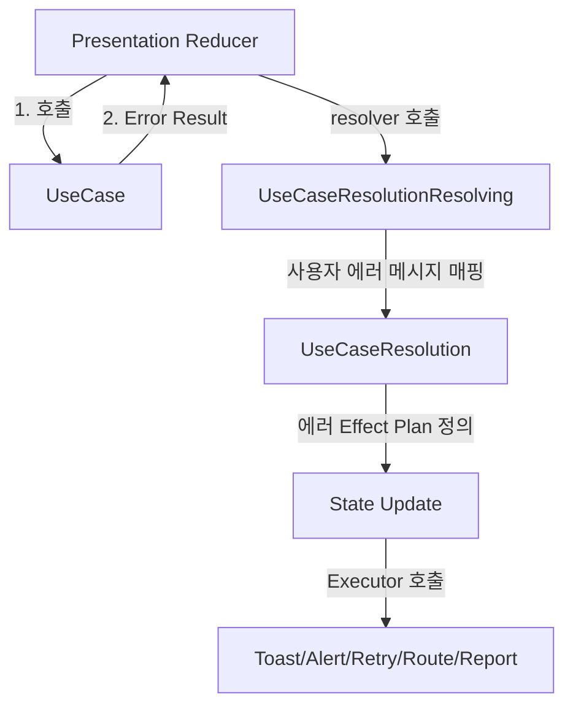
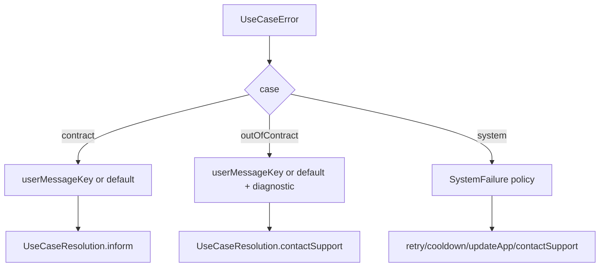

# UseCaseError → UseCaseResolution 사용자 메시지 커스텀 가이드

이 문서는 `UseCaseError<Contract, Boundary>`를 Presentation에서 `UseCaseResolution`로 변환하면서, **사용자에게 보여줄 메시지(키)를 안전하고 유연하게 커스텀하는 방법**을 정리합니다.

> 목표:
>
> - 도메인/유스케이스 에러를 **유저 메시지 + UI 액션(재시도/쿨다운/문의 등)** 으로 일관되게 변환
> - **기본 정책(Default)** 으로 빠르게 커버하면서, 필요한 경우에만 **Partial Resolver**로 정밀 커스텀

## 1. 핵심 타입 및 정책

### 타입

- `SystemFailure`: 의존성 실패/레이트리밋/계약 위반/불변식 위반 등 시스템 성격의 실패
- `UseCaseError<Contract, Boundary>`: 유스케이스 레벨 에러 (3가지)
  - `.contract(Contract)`
  - `.system(SystemFailure)`
  - `.outOfContract(Boundary)`
- `UseCaseResolution`: Presentation이 처리할 “행동 + 메시지” (예시)
  - `.inform(messageKey)`
  - `.retry(messageKey, diagnostic?)`
  - `.cooldown(seconds, messageKey)`
  - `.updateApp(messageKey, diagnostic?)`
  - `.contactSupport(messageKey, diagnostic?)`

### 정책

- **Presentation에서 사용자에게 노출되는 메시지는 "키(messageKey)" 중심**
- `String(describing:)`, enum dump, 내부 오류 문자열을 **절대 사용자에게 노출하지 않는다**
- `diagnostic`은 **로그/리포트 전용** (UI 노출 금지)
- 메시지 차이가 있는 경우:
  - 기본 커버: `UserMessageKeyProviding` 채택
  - 특정 화면/feature만 다르게: **Partial Resolver로 override** (context-aware 해결)

## 2. 플로우 시각화

### 전체 흐름 (개요)



### Default 에러 메시지 처리 세부 흐름



## 3. 커스텀 에러 메시지 수정 방법

### A. 기본 정책만으로 커버하기 (가장 쉬움)

UseCaseResolution의 기본 매핑은 다음 원칙으로 동작합니다:

- .contract(Contract):
  - Contract가 UserMessageKeyProviding이면 그 키 사용
  - 아니면 fallback 키 사용 (예: "error.invalid_input")
- .outOfContract(Boundary):
  - 기본은 문의 유도 (예: "error.out_of_contract")
  - diagnostic에만 내부 정보 기록 (예: "out_of_contract: \(boundary)")
- .system(SystemFailure):
  - 공통 시스템 정책에 의해 retry/cooldown/updateApp/contactSupport로 분기

이 경우, “메시지를 구체화”하려면 아래 B만 추가하면 충분합니다.

### B. 메시지 키 구체화: UserMessageKeyProviding 채택 (권장 1순위)

메시지 차이가 에러 타입 단위로 고정이라면 이 방식이 가장 비용이 낮습니다.

```Swift
protocol UserMessageKeyProviding {
    var userMessageKey: String { get }
}

extension LoginContractError: UserMessageKeyProviding {
    var userMessageKey: String {
        switch self {
        case .invalidPassword: return "login.error.invalid_password"
        case .invalidEmail:    return "login.error.invalid_email"
        }
    }
}
```

- 장점: resolver 수정 없이 메시지 품질 향상
- 주의: userMessageKey에는 “사용자 메시지 키”만 넣는다 (디버그 문자열 금지)

### C. 특정 feature/화면에서만 다르게: Partial Resolver override (권장 2순위)

“같은 에러인데 화면/상황별로 문구가 달라야 하는” context-aware 케이스는 이 방식이 정답입니다.

예: 같은 invalidPassword라도

- 로그인 화면: "login.error.invalid_password"
- 비밀번호 변경 화면: "change_password.error.current_password_invalid"

```Swift
let loginPartial = TypedPartialResolver<LoginContractError, IdentityBoundaryError> { error in
    switch error {
    case .contract(.invalidPassword):
        return .inform("login.error.invalid_password") // 로그인 화면 전용
    default:
        return nil // 나머지는 기본 정책으로
    }
}
```

이 Partial을 ChainedUseCaseResolutionResolver(partials: [...])의 앞쪽에 등록하면,

- matching 되는 케이스는 override,
- 나머지는 공통 UseCaseResolution.resolve(error)로 fallback 됩니다.

## 4. 장단점

### 장점

- 안전성: 내부 문자열 노출 방지 (키 기반 + diagnostic 분리)
- 일관성: 모든 feature가 같은 패턴(Result → Resolve → Apply)으로 에러 처리
- 확장성: 기본 정책으로 빠르게 커버하고, 필요한 곳만 Partial로 정밀 override
- 유지보수성: 거대한 switch tower 대신 “작은 partial”을 조립하는 방식으로 스케일

### 단점 / 트레이드오프

- 정책 분산 위험: Partial이 너무 많아지면 정책이 흩어질 수 있음
  - “정말 필요한 케이스만 override하고 나머지는 fallback(nil)” 규칙이 중요
- 컨텍스트 의존: 화면별 문구가 다르면 Resolver 주입/구성이 필요
  - 컨텍스트별 Env/Resolver 주입으로 해결

### 운영 가이드(권장 룰)

- 기본은 UserMessageKeyProviding로 메시지 품질을 올린다
- 화면/상황별 차이는 Partial Resolver로만 해결한다 (context-aware)
- Partial은 “필요한 케이스만” 처리하고 나머지는 반드시 nil로 fallback
- 사용자 메시지 경로에서 String(describing:) 사용 금지
- diagnostic은 로깅/리포트 전용, UI 노출 금지
